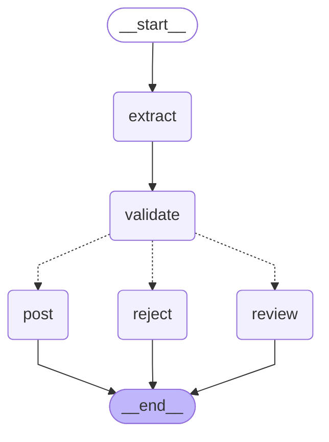

# Invoicing Agent — LangGraph Structure

Generated from the compiled LangGraph. Renders automatically on GitHub.

```mermaid
---
config:
  flowchart:
    curve: linear
---
graph TD;
	__start__([<p>__start__</p>]):::first
	extract(extract)
	validate(validate)
	post(post)
	review(review)
	reject(reject)
	__end__([<p>__end__</p>]):::last
	__start__ --> extract;
	extract --> validate;
	validate -.-> post;
	validate -.-> reject;
	validate -.-> review;
	post --> __end__;
	reject --> __end__;
	review --> __end__;
	classDef default fill:#f2f0ff,line-height:1.2
	classDef first fill-opacity:0
	classDef last fill:#bfb6fc
```
